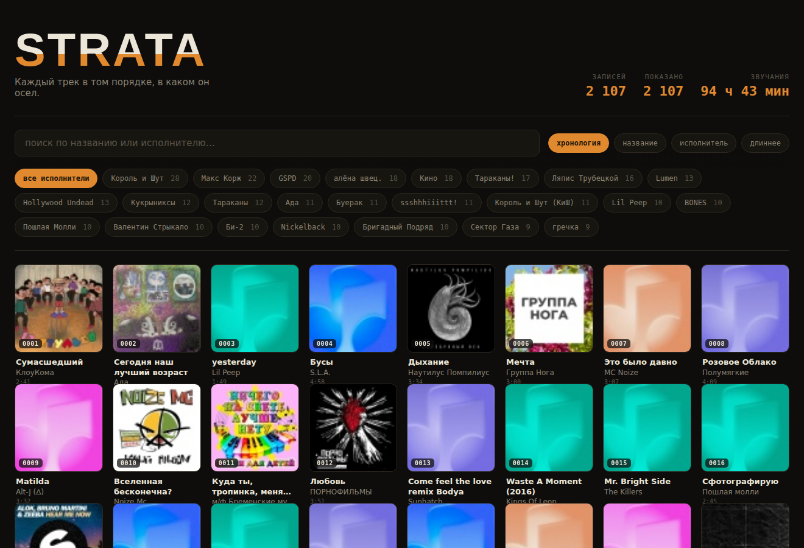

# Strata

A personal strata of music — every track from the collection in the order it settled. Cover, title, artist, duration. Search, filter by artist, sorting, live counters. Pure front end, no backend



## What's inside

- **React + Vite** — a single SPA, built to static files.
- **`src/entities/track/model/tracks.json`** — all tracks: `{ n, artist, title, dur, cover }`. Array order = collection chronology.
- **`public/covers/NNNN.jpg`** — covers, file name = track number with leading zeros (`0001.jpg`).
- **Virtualization** — only visible cards are rendered, so 2000+ covers stay smooth.
- Default/broken covers are replaced with a `♪` placeholder automatically.

## Run locally

```bash
pnpm install
pnpm dev
```

Opens at `http://localhost:3000/strata/`.

## Deploy to GitHub Pages

1. Create a repository named **`strata`** (important — `base` in `vite.config.ts` is set to `/strata/`; if you name it differently, fix it there).
2. Push the project:
   ```bash
   git init
   git add .
   git commit -m "strata: initial"
   git branch -M main
   git remote add origin https://github.com/USERNAME/strata.git
   git push -u origin main
   ```
3. In the repository: **Settings → Pages → Source → GitHub Actions**.
4. The `.github/workflows/deploy.yml` workflow builds and publishes on every push.
5. The site will be at `https://USERNAME.github.io/strata/`.

### Deploy to a user page or custom domain

If you host on `USERNAME.github.io` (root) or your own domain, change in `vite.config.ts`:

```js
base: '/'
```

## Update the collection

Replace `src/entities/track/model/tracks.json` and put new covers in `public/covers/` under the same numbers. The rebuild is automatic on push.

## Notes

- Covers are 68×68 (thumbnails from the source) — intentionally small, ~7 MB in the repo, offline forever.
- One track out of the original 2105 has no cover → replaced with the placeholder.
- Numbering is continuous 1…N and reflects the original collection order.
