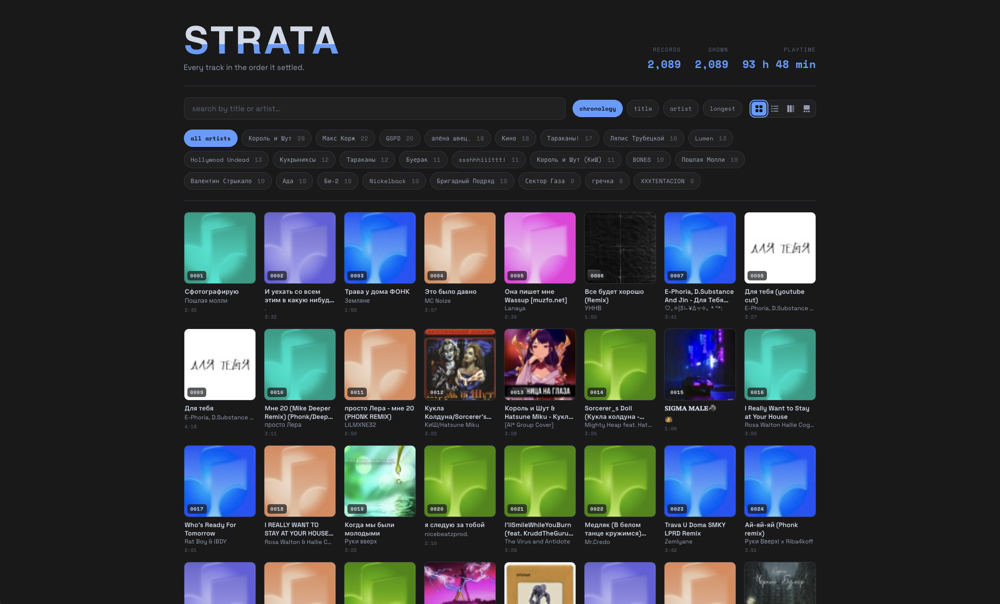

# Strata

A personal strata of music — every track from the collection in the order it settled. Cover, title, artist, duration. Search, filter by artist, sorting, live counters. Pure front end, no backend



## What's inside

- **React + TypeScript + Vite** — a single SPA, built to static files; organized with Feature-Sliced Design (`app`, `features`, `widgets`, `entities`, `shared`).
- **`src/entities/track/model/tracks.json`** — all tracks: `{ n, artist, title, dur, cover }`. Array order = collection chronology; `n` is a continuous 1…N sequence.
- **`public/covers/NNNN.jpg`** — covers, referenced by each track's `cover` field. Filenames keep their original numbers, so they don't necessarily match `n`.
- **Three views** — icons, list, and gallery, switchable from the toolbar; the choice is remembered between visits. Gallery flips through tracks with the ← / → arrow keys.
- **Music links** — every track links to a search for `artist title` on YouTube, Yandex Music, and Spotify (no API keys, pure static).
- **Favorites** — star any track; the list is kept in `localStorage` and survives reloads.
- **Virtualization** — in the grid and list only visible items are rendered, so 2000+ covers stay smooth.
- Default/broken covers are replaced with a `♪` placeholder automatically.

## Run locally

```bash
pnpm install
pnpm dev
```

Opens at `http://localhost:3000/`.

## Deploy

The site is hosted on **Firebase Hosting** and auto-deploys on every push to `main` via GitHub Actions (`.github/workflows/firebase-hosting-merge.yml`). Pull requests get a preview deploy from `firebase-hosting-pull-request.yml`.

Live: **https://strata-music.web.app**

### Manual deploy

```bash
pnpm build
npx firebase-tools deploy --only hosting
```

### Base path

`base` in `vite.config.ts` is `/` by default — Firebase serves the app from the root. It switches to `/strata/` only when `GH_PAGES=1` is set, which the legacy `pnpm deploy` (gh-pages) script does. So no config change is needed for Firebase; the `/strata/` path exists only for an optional GitHub Pages build.

## Update the collection

Replace `src/entities/track/model/tracks.json` and put new covers in `public/covers/` under the same numbers. The rebuild is automatic on push.

## Notes

- Covers are 68×68 (thumbnails from the source) — intentionally small, ~7 MB in the repo, offline forever.
- One track out of the original 2105 has no cover → replaced with the placeholder.
- Numbering is continuous 1…N and reflects the original collection order.
